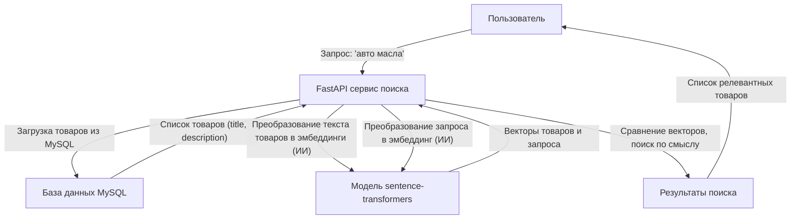

# AI Product Search

Мини-сервис для умного поиска товаров по смыслу на Python + FastAPI + MySQL + sentence-transformers.

## Как работает сервис поиска

### Иллюстрация процесса



### Подробно по этапам

1. **Пользователь отправляет поисковый запрос**
   - Например: «авто масла»

2. **FastAPI сервис получает запрос**
   - Обрабатывает HTTP-запрос `/search?q=авто масла`

3. **Сервис загружает товары из базы MySQL**
   - Берёт только те, что доступны для поиска
   - Использует поля `title` и `description`

4. **ИИ-модель sentence-transformers**
   - Преобразует текст каждого товара в вектор (эмбеддинг)
   - Преобразует текст запроса пользователя в вектор
   - Эти векторы отражают смысл текста, а не просто набор слов

5. **Сравнение векторов**
   - Сервис сравнивает вектор запроса с векторами всех товаров
   - Находит те, что ближе всего по смыслу (даже если слова не совпадают)

6. **Возврат результатов**
   - Сервис возвращает пользователю список товаров, наиболее релевантных запросу

**ИИ в сервисе** — это модель sentence-transformers, которая умеет понимать смысл текста и находить похожие товары даже по синонимам и разным формулировкам.

---

## Вопросы и ответы (FAQ)

### Где здесь используется искусственный интеллект?

ИИ — это модель sentence-transformers (на базе нейросетей), которая:
- Понимает смысл текста на естественном языке.
- Может находить похожие по смыслу тексты, даже если слова не совпадают.
- Работает локально, не требует внешних API.

### Нужно ли обучать модель под свой магазин?

Нет, модель уже обучена (pretrained) на огромных текстовых данных и умеет понимать смысл фраз на многих языках, в том числе на русском. Ты просто используешь её как инструмент: подаёшь текст — получаешь вектор. Для 99% интернет-магазинов стандартная модель работает отлично «из коробки».

### Откуда модель берёт знания о языке и смысле?

Модель обучена на больших датасетах (книги, статьи, диалоги и т.д.), которые подготовили разработчики sentence-transformers. Она не знает ничего о твоих товарах заранее, но умеет понимать смысл любых текстов.

### Нужно ли интернет-соединение для работы?

- Интернет нужен только при первом запуске, чтобы скачать модель (~90 МБ).
- После этого модель хранится локально и сервис работает полностью оффлайн.
- Все вычисления происходят на твоём сервере, данные никуда не отправляются.

### Как происходит поиск?

1. Все товары из базы превращаются в векторы (эмбеддинги) с помощью ИИ-модели.
2. Запрос пользователя тоже превращается в вектор.
3. Сравниваются векторы — находятся товары, которые ближе всего по смыслу к запросу (даже если слова не совпадают).

### Можно ли дообучить модель под свои задачи?

Можно, но для большинства магазинов это не требуется. Если у тебя очень специфические товары или сленг, можно дообучить модель, но это сложнее и требует много данных и вычислительных ресурсов.

---

## Дообучение модели поиска

### 1. Подготовьте датасет пар "запрос — релевантный товар"

Создайте файл `train/data/pairs.jsonl` с примерами:

```
{"query": "король дрифта", "positive": "DRIFT KING Дрифт-легенда R32: Аромат скорости и адреналина."}
{"query": "золотая классика", "positive": "GOLDEN BEAST Золотая классика: Аромат власти и совершенства."}
{"query": "аромат вишни", "positive": "Drift Charm Cherry Подвесной ароматизатор с ароматом вишни."}
```

Каждая строка — отдельный JSON-объект с полями `query` и `positive`.

### 2. Запустите обучение

Выполните:

```
python train/train_model.py
```

После завершения обучения дообученная модель будет сохранена в папке `train/model_finetuned`.

### 3. Используйте дообученную модель в поиске

В файле `app/search_engine.py` замените строку:

```
self.model = SentenceTransformer('paraphrase-multilingual-MiniLM-L12-v2')
```
на
```
self.model = SentenceTransformer('train/model_finetuned')
```

Теперь поиск будет работать на вашей дообученной модели!

---

## Установка вручную

1. Установите зависимости:

```bash
pip install -r requirements.txt
```

2. Укажите параметры подключения к MySQL в `config.py`.

3. Запустите сервер:

```bash
uvicorn main:app --reload
```

## Запуск через Docker

1. Укажите параметры подключения к MySQL в `config.py` (должны быть доступны из контейнера).
2. Соберите и запустите сервис:

```bash
docker-compose up --build
```

3. Сервис будет доступен на http://localhost:8000

## Использование

### Эндпоинт поиска

`GET /search?q=ваш_запрос[&ids_only=true]`

- `q` — поисковый запрос (обязательный)
- `ids_only` — если указать `true`, вернётся только список id найденных товаров (по умолчанию — подробная информация о товарах)

### Примеры

- Получить подробную информацию о товарах:
  ```
  /search?q=авто масла
  ```
- Получить только id найденных товаров:
  ```
  /search?q=авто масла&ids_only=true
  ```

Ответ — список товаров или список id, в зависимости от параметра запроса. 